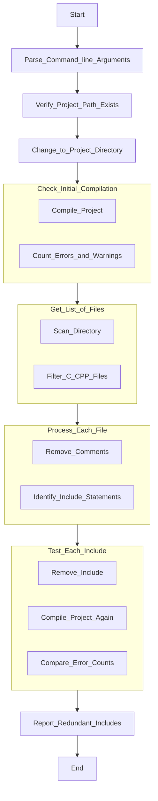

# Include Sweeper

Include Sweeper is a Python script developed to identify and list redundant include statements in C/C++ projects. Redundant includes not only clutter the codebase but also increase compilation times, leading to inefficiencies. By identifying and removing these unnecessary include statements, Include Sweeper helps maintain a cleaner, more efficient codebase. This experimental project aims to address a common challenge faced by developers, enhancing code quality and compilation performance.

## Features

- Automatically scans and processes C/C++ files in the specified project directory.
- Identifies redundant include statements by compiling the project with each include statement removed.
- Reports redundant includes along with their file paths and line numbers.

## Requirements

- Python 3.x
- `tabulate` package (install using `pip install tabulate`)

## Installation

To use Include Sweeper, follow these steps:

1. Clone the repository to your local machine:

```bash
git clone https://github.com/diffstorm/includeSweeper.git
```

2. Navigate to the `includeSweeper` directory:
```bash
cd includeSweeper
```

3. Install the required Python packages using pip:
```bash
pip install -r requirements.txt
```

## Usage

To run the script, use the following command:

```bash
python includeSweeper.py --path [project_path] --cmd [compile_command]
```

Replace `[project_path]` with the path to your C/C++ project directory, and `[compile_command]` with the command used to compile your project. For example:
```bash
python src/includeSweeper.py --path "my-project" --cmd "gcc src/main.c"
```

```bash
python src/includeSweeper.py --path "test/" --cmd "make"
```

Include Sweeper will then analyze your project, identify redundant includes, and provide a report of the findings.
```bash
Redundant Includes:
+----+-----------+------------+--------+
|    | Include   | File       |   Line |
+====+===========+============+========+
|  0 | stdint.h  | src\main.c |     13 |
+----+-----------+------------+--------+
|  1 | stddef.h  | src\main.c |     15 |
+----+-----------+------------+--------+
|  2 | stdlib.h  | src\main.c |     16 |
+----+-----------+------------+--------+
```
Manually remove the includes found by Include Sweeper.

## Flowchart
For a visual representation of the logic in Include Sweeper, refer to the flowchart provided in the repository.


## TODO
- Implement detection of includes hidden behind define switches
- Add `--remove` option to remove the redundant includes
- If the same include comes in another include file, both files can be seen as redundant includes. A different approach is needed instead of removing the includes one by one.

## :snowman: Author
Eray Öztürk ([@diffstorm](https://github.com/diffstorm))

## LICENSE
This project is licensed under the [MIT License](LICENSE) - see the LICENSE file for details.